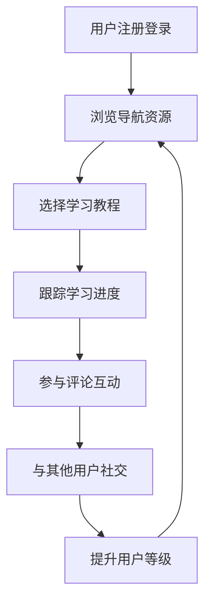

## 1. 产品概览
AI导航网站是一个集AI教程、资源工具和社交互动于一体的学习平台，帮助用户发现和学习AI相关知识。
- 主要目的是为用户提供AI领域的优质资源导航，解决用户在AI学习和应用过程中的信息获取问题。
- 目标用户为AI爱好者、学生、开发者和专业人士，市场价值在于简化AI学习路径，促进知识共享。

## 2. 核心功能

### 2.1 用户角色
| 角色 | 注册方式 | 核心权限 |
|------|---------------------|------------------|
| 普通用户 | 邮箱/第三方登录 | 浏览内容、评论、加好友、学习追踪 |
| 高级用户 | 基于等级晋升 | 更多特权、内容创作、社区管理 |

### 2.2 功能模块
1. **首页**：英雄区、导航分类、热门教程、最新资源
2. **导航页**：分类导航、搜索筛选、用户推荐
3. **教程页**：教程内容、学习进度、评论互动
4. **资源工具页**：工具列表、使用指南、用户评价
5. **个人中心**：用户信息、学习统计、好友列表、消息中心
6. **社交页**：好友管理、私信聊天、用户等级

### 2.3 页面详情
| 页面名称 | 模块名称 | 功能描述 |
|-----------|-------------|---------------------|
| 首页 | 英雄区 | 展示网站主题、最新活动、推荐内容 |
| 首页 | 导航分类 | 提供AI相关分类导航，如工具、教程、资源等 |
| 首页 | 热门教程 | 展示用户关注度高的AI教程 |
| 首页 | 最新资源 | 展示最新添加的AI资源和工具 |
| 导航页 | 分类导航 | 详细的AI资源分类，支持多级分类 |
| 导航页 | 搜索筛选 | 支持关键词搜索和多维度筛选 |
| 导航页 | 用户推荐 | 基于用户兴趣和学习历史推荐资源 |
| 教程页 | 教程内容 | 详细的AI教程内容，支持图文和视频 |
| 教程页 | 学习进度 | 追踪用户学习进度，记录完成情况 |
| 教程页 | 评论互动 | 支持用户评论、上传图片和视频、点赞 |
| 资源工具页 | 工具列表 | 展示AI相关工具，包含功能介绍和使用链接 |
| 资源工具页 | 使用指南 | 提供工具使用说明和最佳实践 |
| 资源工具页 | 用户评价 | 展示用户对工具的评价和使用心得 |
| 个人中心 | 用户信息 | 展示和编辑用户个人信息 |
| 个人中心 | 学习统计 | 展示用户学习时长、完成课程数等数据 |
| 个人中心 | 好友列表 | 管理用户好友关系，查看好友动态 |
| 个人中心 | 消息中心 | 接收系统通知和好友私信 |
| 社交页 | 好友管理 | 发送好友请求、接受/拒绝请求 |
| 社交页 | 私信聊天 | 与好友进行一对一私信交流 |
| 社交页 | 用户等级 | 展示用户等级、经验值、晋升条件 |

## 3. 核心流程
用户注册登录 → 浏览导航资源 → 选择学习教程 → 跟踪学习进度 → 参与评论互动 → 与其他用户社交 → 提升用户等级

## 4. 用户界面设计
### 4.1 设计风格
- 主色调：深蓝色(#1a365d)和科技蓝(#3182ce)，辅助色：活力橙(#ed8936)
- 按钮风格：圆角设计，有轻微的3D效果，悬停时有渐变动画
- 字体：主标题使用无衬线字体，正文使用清晰易读的系统字体
- 布局风格：卡片式布局，顶部导航栏，响应式设计
- 图标风格：现代简约风格，使用线性图标，关键操作有微动画

### 4.2 页面设计概览
| 页面名称 | 模块名称 | UI元素 |
|-----------|-------------|-------------|
| 首页 | 英雄区 | 渐变背景，大型标题，简短描述，CTA按钮，动态效果 |
| 首页 | 导航分类 | 网格布局，分类卡片，图标+文字，悬停效果 |
| 首页 | 热门教程 | 卡片列表，缩略图，标题，简介，学习人数 |
| 导航页 | 分类导航 | 侧边栏分类树，主内容区资源列表 |
| 教程页 | 教程内容 | 响应式布局，章节导航，内容区，进度条 |
| 教程页 | 评论互动 | 评论区，表情按钮，图片/视频上传，点赞按钮 |
| 个人中心 | 学习统计 | 数据可视化图表，进度环，统计数字 |
| 社交页 | 私信聊天 | 聊天界面，消息列表，输入框，表情/附件功能 |

### 4.3 响应性
- 采用桌面优先设计，同时支持平板和移动设备
- 移动端适配：导航栏折叠为汉堡菜单，卡片布局调整为单列
- 触摸优化：增大点击区域，支持滑动操作

### 4.4 3D场景指导
- 可选：在首页英雄区添加简单的3D效果，如浮动的AI相关图标或粒子效果
- 保持性能优先，确保在低配置设备上也能流畅运行