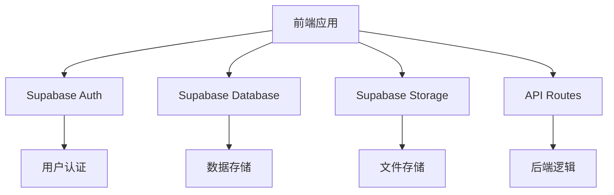
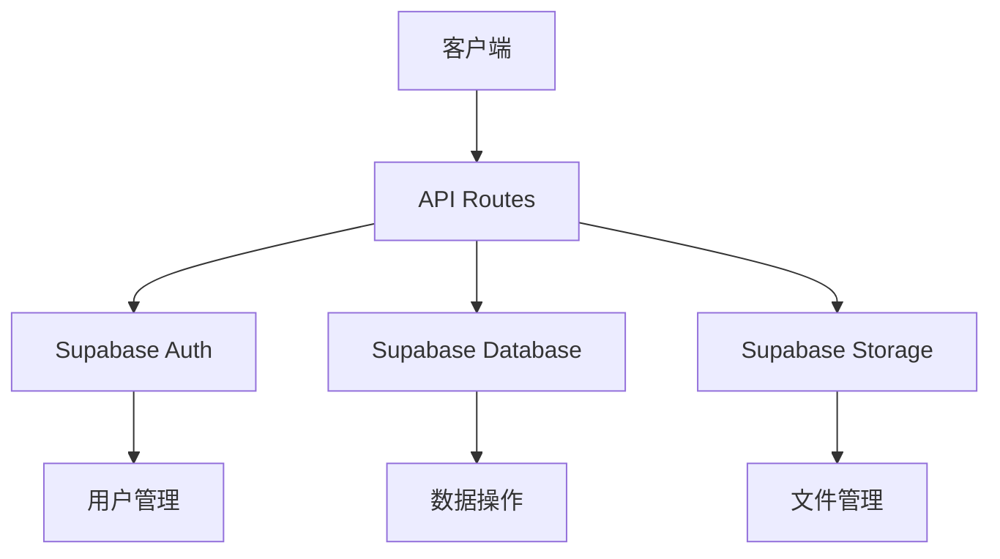
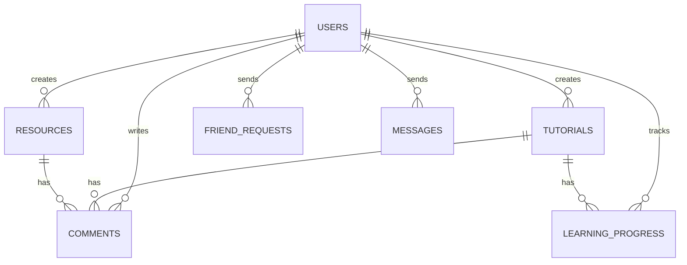

## 1. 架构设计


## 2. 技术描述
- 前端：React@18 + TypeScript + TailwindCSS@3 + Vite
- 初始化工具：vite-init
- 后端：Supabase (认证、数据库、存储)
- 数据库：Supabase (PostgreSQL)
- 状态管理：Zustand
- 路由：React Router DOM
- UI组件：自定义组件 + Lucide React图标

## 3. 路由定义
| 路由 | 用途 |
|-------|---------|
| / | 首页 |
| /navigate | 导航页 |
| /tutorials | 教程列表 |
| /tutorials/:id | 教程详情页 |
| /resources | 资源工具页 |
| /resources/:id | 资源详情页 |
| /profile | 个人中心 |
| /profile/:id | 其他用户个人页面 |
| /social | 社交页面 |
| /social/messages | 消息中心 |
| /social/friends | 好友列表 |
| /login | 登录页 |
| /register | 注册页 |

## 4. API定义
### 4.1 前端API调用
- 使用Supabase客户端SDK进行数据库操作
- 使用Supabase Auth进行用户认证
- 使用Supabase Storage进行文件上传和管理

### 4.2 后端API路由
| 路由 | 方法 | 功能 |
|-------|------|---------|
| /api/user/level | GET | 获取用户等级信息 |
| /api/user/statistics | GET | 获取用户学习统计数据 |
| /api/tutorials/progress | POST | 更新学习进度 |
| /api/comments | POST | 创建评论 |
| /api/comments/:id | DELETE | 删除评论 |
| /api/friends | POST | 发送好友请求 |
| /api/friends/:id | PUT | 处理好友请求 |
| /api/messages | POST | 发送消息 |
| /api/messages/:id | GET | 获取消息历史 |

## 5. 服务器架构图


## 6. 数据模型
### 6.1 数据模型定义


### 6.2 数据定义语言
#### 用户表 (users)
```sql
CREATE TABLE users (
  id UUID PRIMARY KEY REFERENCES auth.users(id),
  username VARCHAR(50) UNIQUE NOT NULL,
  avatar_url VARCHAR(255),
  bio TEXT,
  level INTEGER DEFAULT 1,
  experience INTEGER DEFAULT 0,
  online_time INTEGER DEFAULT 0, -- 在线时长（分钟）
  learning_time INTEGER DEFAULT 0, -- 学习时长（分钟）
  created_at TIMESTAMP DEFAULT NOW(),
  updated_at TIMESTAMP DEFAULT NOW()
);

CREATE INDEX idx_users_level ON users(level);
CREATE INDEX idx_users_username ON users(username);
```

#### 教程表 (tutorials)
```sql
CREATE TABLE tutorials (
  id UUID PRIMARY KEY DEFAULT gen_random_uuid(),
  title VARCHAR(255) NOT NULL,
  description TEXT,
  content TEXT NOT NULL,
  cover_image VARCHAR(255),
  category VARCHAR(50),
  difficulty VARCHAR(20),
  duration INTEGER, -- 预计学习时长（分钟）
  author_id UUID REFERENCES users(id),
  view_count INTEGER DEFAULT 0,
  like_count INTEGER DEFAULT 0,
  created_at TIMESTAMP DEFAULT NOW(),
  updated_at TIMESTAMP DEFAULT NOW()
);

CREATE INDEX idx_tutorials_category ON tutorials(category);
CREATE INDEX idx_tutorials_difficulty ON tutorials(difficulty);
CREATE INDEX idx_tutorials_author_id ON tutorials(author_id);
```

#### 资源工具表 (resources)
```sql
CREATE TABLE resources (
  id UUID PRIMARY KEY DEFAULT gen_random_uuid(),
  name VARCHAR(255) NOT NULL,
  description TEXT,
  url VARCHAR(255) NOT NULL,
  category VARCHAR(50),
  icon VARCHAR(255),
  author_id UUID REFERENCES users(id),
  view_count INTEGER DEFAULT 0,
  like_count INTEGER DEFAULT 0,
  created_at TIMESTAMP DEFAULT NOW(),
  updated_at TIMESTAMP DEFAULT NOW()
);

CREATE INDEX idx_resources_category ON resources(category);
CREATE INDEX idx_resources_author_id ON resources(author_id);
```

#### 评论表 (comments)
```sql
CREATE TABLE comments (
  id UUID PRIMARY KEY DEFAULT gen_random_uuid(),
  content TEXT NOT NULL,
  user_id UUID REFERENCES users(id),
  target_id UUID, -- 关联教程或资源的ID
  target_type VARCHAR(20), -- 'tutorial' 或 'resource'
  image_url VARCHAR(255), -- 评论中上传的图片
  video_url VARCHAR(255), -- 评论中上传的视频
  like_count INTEGER DEFAULT 0,
  created_at TIMESTAMP DEFAULT NOW(),
  updated_at TIMESTAMP DEFAULT NOW()
);

CREATE INDEX idx_comments_user_id ON comments(user_id);
CREATE INDEX idx_comments_target ON comments(target_id, target_type);
```

#### 学习进度表 (learning_progress)
```sql
CREATE TABLE learning_progress (
  id UUID PRIMARY KEY DEFAULT gen_random_uuid(),
  user_id UUID REFERENCES users(id),
  tutorial_id UUID REFERENCES tutorials(id),
  progress INTEGER DEFAULT 0, -- 完成百分比
  completed BOOLEAN DEFAULT FALSE,
  last_accessed TIMESTAMP DEFAULT NOW(),
  created_at TIMESTAMP DEFAULT NOW(),
  updated_at TIMESTAMP DEFAULT NOW(),
  UNIQUE(user_id, tutorial_id)
);

CREATE INDEX idx_learning_progress_user ON learning_progress(user_id);
CREATE INDEX idx_learning_progress_tutorial ON learning_progress(tutorial_id);
```

#### 好友请求表 (friend_requests)
```sql
CREATE TABLE friend_requests (
  id UUID PRIMARY KEY DEFAULT gen_random_uuid(),
  sender_id UUID REFERENCES users(id),
  receiver_id UUID REFERENCES users(id),
  status VARCHAR(20) DEFAULT 'pending', -- 'pending', 'accepted', 'rejected'
  created_at TIMESTAMP DEFAULT NOW(),
  updated_at TIMESTAMP DEFAULT NOW()
);

CREATE INDEX idx_friend_requests_sender ON friend_requests(sender_id);
CREATE INDEX idx_friend_requests_receiver ON friend_requests(receiver_id);
```

#### 好友关系表 (friends)
```sql
CREATE TABLE friends (
  id UUID PRIMARY KEY DEFAULT gen_random_uuid(),
  user_id1 UUID REFERENCES users(id),
  user_id2 UUID REFERENCES users(id),
  created_at TIMESTAMP DEFAULT NOW(),
  UNIQUE(user_id1, user_id2)
);

CREATE INDEX idx_friends_user1 ON friends(user_id1);
CREATE INDEX idx_friends_user2 ON friends(user_id2);
```

#### 消息表 (messages)
```sql
CREATE TABLE messages (
  id UUID PRIMARY KEY DEFAULT gen_random_uuid(),
  sender_id UUID REFERENCES users(id),
  receiver_id UUID REFERENCES users(id),
  content TEXT NOT NULL,
  read BOOLEAN DEFAULT FALSE,
  created_at TIMESTAMP DEFAULT NOW()
);

CREATE INDEX idx_messages_sender ON messages(sender_id);
CREATE INDEX idx_messages_receiver ON messages(receiver_id);
CREATE INDEX idx_messages_read ON messages(read);
```

#### 用户活动表 (user_activities)
```sql
CREATE TABLE user_activities (
  id UUID PRIMARY KEY DEFAULT gen_random_uuid(),
  user_id UUID REFERENCES users(id),
  activity_type VARCHAR(50), -- 'login', 'comment', 'learn', 'friend'
  activity_data JSONB,
  created_at TIMESTAMP DEFAULT NOW()
);

CREATE INDEX idx_user_activities_user ON user_activities(user_id);
CREATE INDEX idx_user_activities_type ON user_activities(activity_type);
```