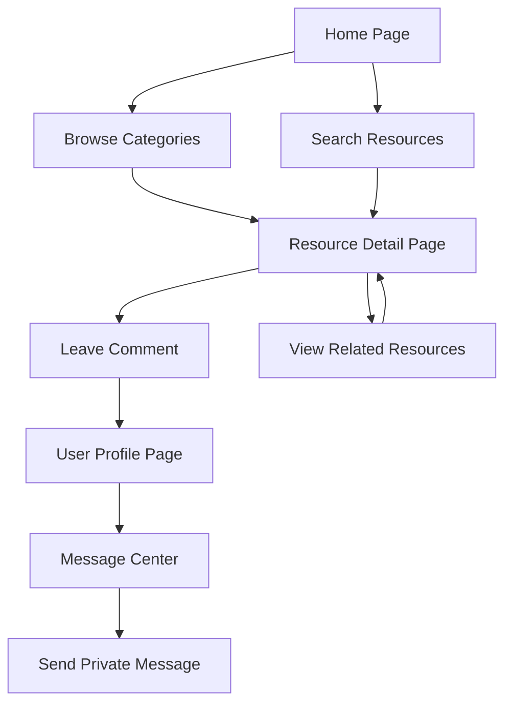

## 1. Product Overview
AI资源导航网站是一个聚合全球AI工具、教程、资讯和资源的综合性平台，帮助用户快速找到所需的AI相关内容。
- 解决用户在海量AI资源中难以快速定位高质量内容的问题，为AI爱好者、开发者和企业用户提供便捷的资源获取渠道。
- 目标是成为AI领域的权威导航平台，通过分类整理和用户互动提升资源发现效率。

## 2. Core Features

### 2.1 User Roles
| Role | Registration Method | Core Permissions |
|------|---------------------|------------------|
| Normal User | Email registration | Browse resources, leave comments, send private messages |
| Admin | Invitation only | Manage resources, moderate comments, manage users |

### 2.2 Feature Module
1. **Home page**: Resource categories, featured resources, search functionality, user interaction area
2. **Resource detail page**: Resource information, user comments, related resources
3. **User profile page**: User information, comment history, message center

### 2.3 Page Details
| Page Name | Module Name | Feature description |
|-----------|-------------|---------------------|
| Home page | Resource categories | Display multiple categories of AI resources (tutorials, tools, news, resources) with filtering and sorting options |
| Home page | Featured resources | Showcase high-quality or popular AI resources with visual cards |
| Home page | Search functionality | Allow users to search for specific AI resources across categories |
| Home page | User interaction area | Enable users to comment on resources, like content, and send private messages |
| Resource detail page | Resource information | Provide detailed information about the resource, including description, link, and tags |
| Resource detail page | User comments | Allow users to leave comments and discuss the resource |
| Resource detail page | Related resources | Suggest similar or related AI resources based on the current resource |
| User profile page | User information | Display user profile details, including avatar, bio, and activity history |
| User profile page | Comment history | Show user's past comments on resources |
| User profile page | Message center | Enable users to send and receive private messages |

## 3. Core Process
1. User visits the home page and browses through resource categories
2. User can search for specific resources using the search functionality
3. User clicks on a resource card to view detailed information
4. User can leave comments on resources and interact with other users
5. User can send private messages to other users
6. User can register/login to access personalized features

## 4. User Interface Design
### 4.1 Design Style
- Primary colors: #FAFAFA (background), #F7F9FB (alternative background)
- Accent colors: Flowing adjacent hues with micro-conflicts between warm and cool tones
- Button style: 100% Rounded buttons with subtle gradients or solid fills
- Font: Modern sans-serif fonts with clear hierarchy
- Layout style: Card-based layout with high diffusion shadows for lightweight floating effect
- Icon style: Soft, geometric shapes with claymorphism or high-gloss surface treatment

### 4.2 Page Design Overview
| Page Name | Module Name | UI Elements |
|-----------|-------------|-------------|
| Home page | Resource categories | Frosted glass navigation bar with subtle gradient, category cards with high diffusion shadows, smooth hover transitions |
| Home page | Featured resources | Large hero section with dynamic light effects, featured resource cards with floating animation, spotlight effect on hover |
| Home page | Search functionality | Full-width search bar with fluid morphing animation, search results with smooth reveal effect |
| Home page | User interaction area | Comment sections with frosted glass background, message icons with pulse animation |
| Resource detail page | Resource information | Hero section with resource preview, detailed content with clean typography, call-to-action buttons with gradient effects |
| Resource detail page | User comments | Comment cards with frosted glass effect, reply functionality with smooth transitions |
| User profile page | User information | Profile header with frosted glass background, activity timeline with subtle animations |
| User profile page | Message center | Chat interface with fluid morphing bubbles, message notifications with pulse effect |

### 4.3 Responsiveness
- Desktop-first design with mobile-adaptive layout
- Touch optimization for mobile devices
- Responsive grid system that adapts to different screen sizes
- Collapsible navigation for mobile devices

### 4.4 3D Scene Guidance
- Environment: Light, airy digital space with subtle gradient background
- Lighting setup: Dynamic light sources that follow cursor movement, creating spotlight effects
- Camera settings: Slight parallax effect for depth perception
- Composition: Geometric shapes as decorative elements, floating in 3D space
- Interactions: Fluid morphing of UI elements on hover, subtle rotation of 3D elements
- Post-processing effects: Subtle bloom and depth of field for enhanced visual appeal