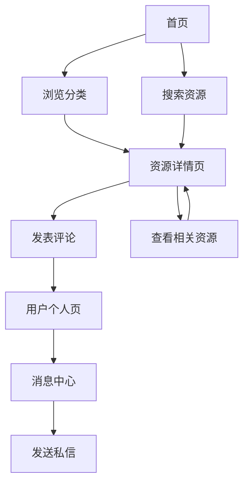

## 1. 产品概览
AI资源导航网站是一个聚合全球AI工具、教程、资讯和资源的综合性平台，帮助用户快速找到所需的AI相关内容。
- 解决用户在海量AI资源中难以快速定位高质量内容的问题，为AI爱好者、开发者和企业用户提供便捷的资源获取渠道。
- 目标是成为AI领域的权威导航平台，通过分类整理和用户互动提升资源发现效率。

## 2. 核心功能

### 2.1 用户角色
| 角色 | 注册方式 | 核心权限 |
|------|---------------------|------------------|
| 普通用户 | 邮箱注册 | 浏览资源、发表评论、发送私信 |
| 管理员 | 邀请制 | 管理资源、审核评论、管理用户 |

### 2.2 功能模块
1. **首页**：资源分类、精选资源、搜索功能、用户互动区域
2. **资源详情页**：资源信息、用户评论、相关资源
3. **用户个人页**：用户信息、评论历史、消息中心

### 2.3 页面详情
| 页面名称 | 模块名称 | 功能描述 |
|-----------|-------------|---------------------|
| 首页 | 资源分类 | 展示多个AI资源分类（教程、工具、资讯、资源），提供筛选和排序选项 |
| 首页 | 精选资源 | 展示高质量或热门的AI资源，使用视觉卡片呈现 |
| 首页 | 搜索功能 | 允许用户跨分类搜索特定的AI资源 |
| 首页 | 用户互动区域 | 允许用户对资源发表评论、点赞内容、发送私信 |
| 资源详情页 | 资源信息 | 提供资源的详细信息，包括描述、链接和标签 |
| 资源详情页 | 用户评论 | 允许用户留下评论并讨论资源 |
| 资源详情页 | 相关资源 | 根据当前资源推荐相似或相关的AI资源 |
| 用户个人页 | 用户信息 | 显示用户个人资料详情，包括头像、简介和活动历史 |
| 用户个人页 | 评论历史 | 显示用户过去对资源的评论 |
| 用户个人页 | 消息中心 | 允许用户发送和接收私信 |

## 3. 核心流程
1. 用户访问首页并浏览资源分类
2. 用户可以使用搜索功能查找特定资源
3. 用户点击资源卡片查看详细信息
4. 用户可以对资源发表评论并与其他用户互动
5. 用户可以发送私信给其他用户
6. 用户可以注册/登录以访问个性化功能

## 4. 用户界面设计
### 4.1 设计风格
- 主色调：#FAFAFA（背景）、#F7F9FB（替代背景）
- 强调色：流畅的邻近色，通过冷暖色调间的微对比模拟认知活力
- 按钮风格：全圆角按钮（100% Rounded buttons），采用细腻渐变或纯色填充设计
- 字体：现代无衬线字体，清晰的层次结构
- 布局风格：卡片式布局，搭配高扩散阴影，营造轻盈悬浮的视觉效果
- 图标风格：柔软的几何形状，采用黏土质感或高光泽表面处理

### 4.2 页面设计概览
| 页面名称 | 模块名称 | UI元素 |
|-----------|-------------|-------------|
| 首页 | 资源分类 | 毛玻璃效果导航栏，带有微妙渐变，分类卡片带有高扩散阴影，平滑的悬停过渡效果 |
| 首页 | 精选资源 | 大型英雄区带有动态光影效果，精选资源卡片带有悬浮动画，悬停时的聚光效果 |
| 首页 | 搜索功能 | 全宽搜索栏带有流体形变动画，搜索结果带有平滑的显现效果 |
| 首页 | 用户互动区域 | 评论区带有毛玻璃背景，消息图标带有脉冲动画 |
| 资源详情页 | 资源信息 | 英雄区带有资源预览，详细内容带有清晰的排版，行动号召按钮带有渐变效果 |
| 资源详情页 | 用户评论 | 评论卡片带有毛玻璃效果，回复功能带有平滑过渡 |
| 用户个人页 | 用户信息 | 个人资料头部带有毛玻璃背景，活动时间线带有微妙动画 |
| 用户个人页 | 消息中心 | 聊天界面带有流体形变气泡，消息通知带有脉冲效果 |

### 4.3 响应式设计
- 桌面优先设计，适配移动设备
- 移动设备的触摸优化
- 响应式网格系统，适应不同屏幕尺寸
- 移动设备的可折叠导航

### 4.4 3D场景指导
- 环境：明亮、通透的数字空间，带有微妙的渐变背景
- 灯光设置：动态光源跟随光标移动，创建聚光效果
- 相机设置：轻微的视差效果，增强深度感知
- 构图：几何形状作为装饰元素，漂浮在3D空间中
- 交互：UI元素在悬停时的流体形变，3D元素的微妙旋转
- 后期处理效果：微妙的光晕和景深，增强视觉吸引力