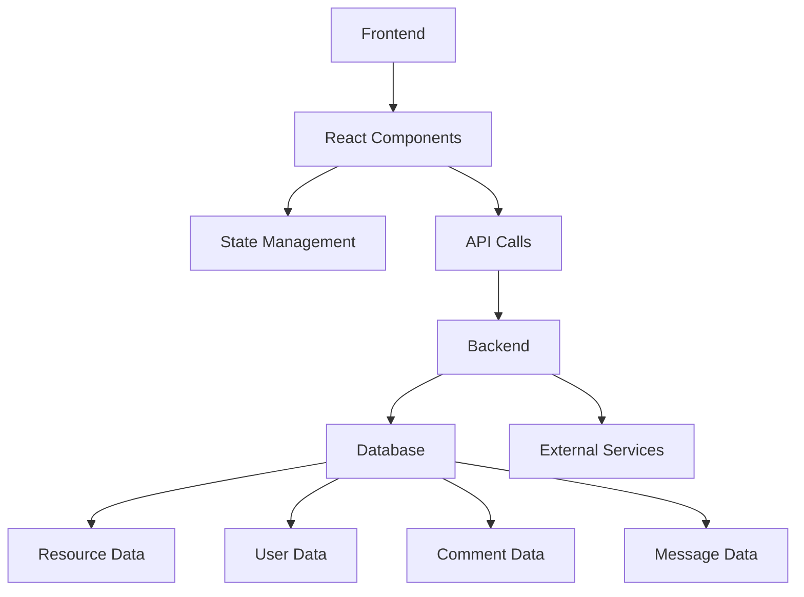
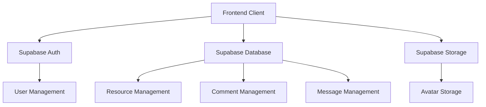
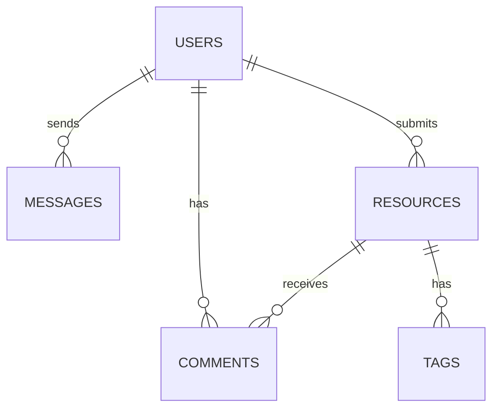

## 1. Architecture Design


## 2. Technology Description
- Frontend: React@18 + TypeScript + Tailwind CSS@3 + Vite
- Initialization Tool: vite-init
- Backend: Supabase (for authentication, database, and storage)
- Database: Supabase (PostgreSQL)
- Additional Libraries:
  - Zustand (state management)
  - Lucide React (icons)
  - React Router DOM (routing)

## 3. Route Definitions
| Route | Purpose |
|-------|---------|
| / | Home page with resource categories and featured content |
| /resource/:id | Resource detail page with comments and related resources |
| /profile/:id | User profile page with activity history and message center |
| /login | User login page |
| /register | User registration page |

## 4. API Definitions
### 4.1 Supabase Client API
- Authentication: Sign up, sign in, sign out
- Database: CRUD operations for resources, comments, and messages
- Storage: Upload and retrieve user avatars

## 5. Server Architecture Diagram


## 6. Data Model
### 6.1 Data Model Definition


### 6.2 Data Definition Language
#### Users Table
```sql
CREATE TABLE users (
  id UUID PRIMARY KEY DEFAULT gen_random_uuid(),
  email VARCHAR(255) UNIQUE NOT NULL,
  username VARCHAR(50) UNIQUE NOT NULL,
  avatar_url VARCHAR(255),
  bio TEXT,
  created_at TIMESTAMP DEFAULT NOW()
);

-- Grant permissions
GRANT SELECT ON users TO anon;
GRANT ALL PRIVILEGES ON users TO authenticated;
```

#### Resources Table
```sql
CREATE TABLE resources (
  id UUID PRIMARY KEY DEFAULT gen_random_uuid(),
  title VARCHAR(255) NOT NULL,
  description TEXT NOT NULL,
  url VARCHAR(255) NOT NULL,
  category VARCHAR(50) NOT NULL,
  tags VARCHAR(255)[],
  user_id UUID REFERENCES users(id),
  created_at TIMESTAMP DEFAULT NOW(),
  updated_at TIMESTAMP DEFAULT NOW()
);

-- Create index for category search
CREATE INDEX idx_resources_category ON resources(category);

-- Grant permissions
GRANT SELECT ON resources TO anon;
GRANT ALL PRIVILEGES ON resources TO authenticated;
```

#### Comments Table
```sql
CREATE TABLE comments (
  id UUID PRIMARY KEY DEFAULT gen_random_uuid(),
  resource_id UUID REFERENCES resources(id),
  user_id UUID REFERENCES users(id),
  content TEXT NOT NULL,
  created_at TIMESTAMP DEFAULT NOW()
);

-- Create index for resource comments
CREATE INDEX idx_comments_resource_id ON comments(resource_id);

-- Grant permissions
GRANT SELECT ON comments TO anon;
GRANT ALL PRIVILEGES ON comments TO authenticated;
```

#### Messages Table
```sql
CREATE TABLE messages (
  id UUID PRIMARY KEY DEFAULT gen_random_uuid(),
  sender_id UUID REFERENCES users(id),
  receiver_id UUID REFERENCES users(id),
  content TEXT NOT NULL,
  read BOOLEAN DEFAULT FALSE,
  created_at TIMESTAMP DEFAULT NOW()
);

-- Create index for user messages
CREATE INDEX idx_messages_sender_id ON messages(sender_id);
CREATE INDEX idx_messages_receiver_id ON messages(receiver_id);

-- Grant permissions
GRANT SELECT ON messages TO authenticated;
GRANT ALL PRIVILEGES ON messages TO authenticated;
```

#### Tags Table
```sql
CREATE TABLE tags (
  id UUID PRIMARY KEY DEFAULT gen_random_uuid(),
  name VARCHAR(50) UNIQUE NOT NULL,
  created_at TIMESTAMP DEFAULT NOW()
);

-- Grant permissions
GRANT SELECT ON tags TO anon;
GRANT ALL PRIVILEGES ON tags TO authenticated;
```