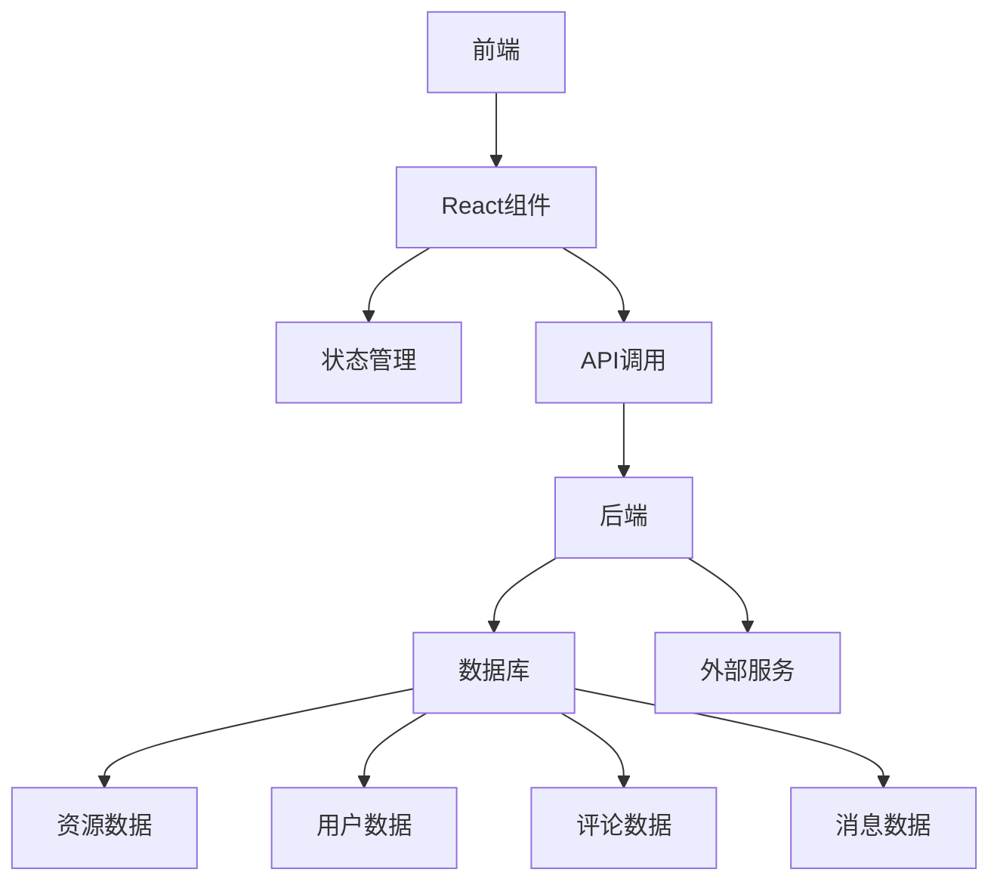
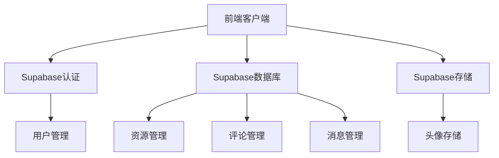
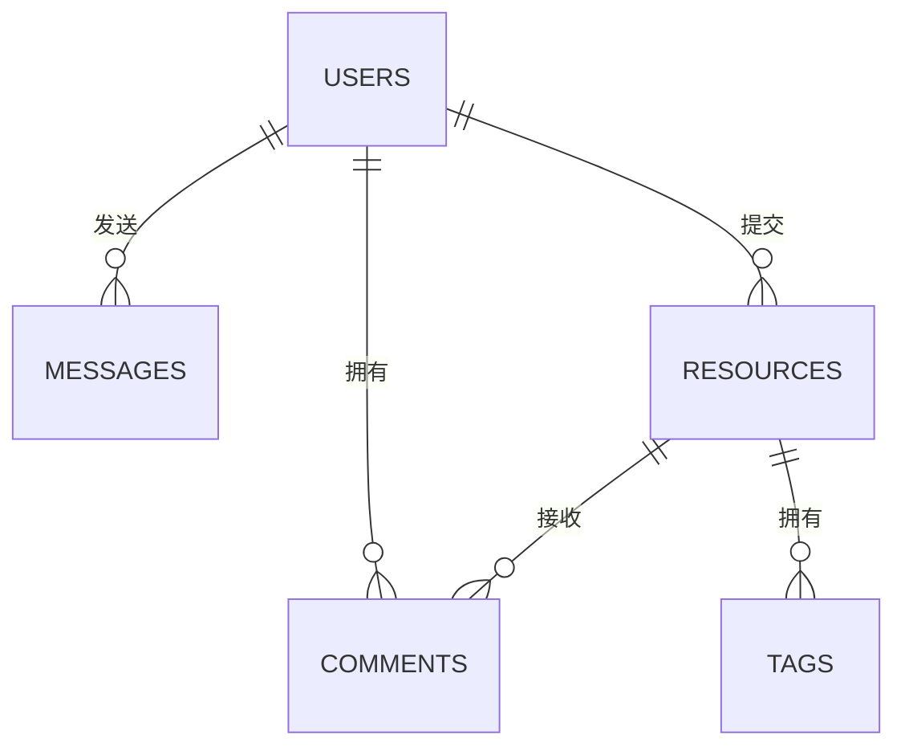

## 1. 架构设计


## 2. 技术描述
- 前端：React@18 + TypeScript + Tailwind CSS@3 + Vite
- 初始化工具：vite-init
- 后端：Supabase（用于认证、数据库和存储）
- 数据库：Supabase（PostgreSQL）
- 其他库：
  - Zustand（状态管理）
  - Lucide React（图标）
  - React Router DOM（路由）

## 3. 路由定义
| 路由 | 用途 |
|-------|---------|
| / | 首页，包含资源分类和精选内容 |
| /resource/:id | 资源详情页，包含评论和相关资源 |
| /profile/:id | 用户个人页，包含活动历史和消息中心 |
| /login | 用户登录页 |
| /register | 用户注册页 |

## 4. API定义
### 4.1 Supabase客户端API
- 认证：注册、登录、登出
- 数据库：资源、评论和消息的CRUD操作
- 存储：上传和获取用户头像

## 5. 服务器架构图


## 6. 数据模型
### 6.1 数据模型定义


### 6.2 数据定义语言
#### 用户表
```sql
CREATE TABLE users (
  id UUID PRIMARY KEY DEFAULT gen_random_uuid(),
  email VARCHAR(255) UNIQUE NOT NULL,
  username VARCHAR(50) UNIQUE NOT NULL,
  avatar_url VARCHAR(255),
  bio TEXT,
  created_at TIMESTAMP DEFAULT NOW()
);

-- 授予权限
GRANT SELECT ON users TO anon;
GRANT ALL PRIVILEGES ON users TO authenticated;
```

#### 资源表
```sql
CREATE TABLE resources (
  id UUID PRIMARY KEY DEFAULT gen_random_uuid(),
  title VARCHAR(255) NOT NULL,
  description TEXT NOT NULL,
  url VARCHAR(255) NOT NULL,
  category VARCHAR(50) NOT NULL,
  tags VARCHAR(255)[],
  user_id UUID REFERENCES users(id),
  created_at TIMESTAMP DEFAULT NOW(),
  updated_at TIMESTAMP DEFAULT NOW()
);

-- 创建分类搜索索引
CREATE INDEX idx_resources_category ON resources(category);

-- 授予权限
GRANT SELECT ON resources TO anon;
GRANT ALL PRIVILEGES ON resources TO authenticated;
```

#### 评论表
```sql
CREATE TABLE comments (
  id UUID PRIMARY KEY DEFAULT gen_random_uuid(),
  resource_id UUID REFERENCES resources(id),
  user_id UUID REFERENCES users(id),
  content TEXT NOT NULL,
  created_at TIMESTAMP DEFAULT NOW()
);

-- 创建资源评论索引
CREATE INDEX idx_comments_resource_id ON comments(resource_id);

-- 授予权限
GRANT SELECT ON comments TO anon;
GRANT ALL PRIVILEGES ON comments TO authenticated;
```

#### 消息表
```sql
CREATE TABLE messages (
  id UUID PRIMARY KEY DEFAULT gen_random_uuid(),
  sender_id UUID REFERENCES users(id),
  receiver_id UUID REFERENCES users(id),
  content TEXT NOT NULL,
  read BOOLEAN DEFAULT FALSE,
  created_at TIMESTAMP DEFAULT NOW()
);

-- 创建用户消息索引
CREATE INDEX idx_messages_sender_id ON messages(sender_id);
CREATE INDEX idx_messages_receiver_id ON messages(receiver_id);

-- 授予权限
GRANT SELECT ON messages TO authenticated;
GRANT ALL PRIVILEGES ON messages TO authenticated;
```

#### 标签表
```sql
CREATE TABLE tags (
  id UUID PRIMARY KEY DEFAULT gen_random_uuid(),
  name VARCHAR(50) UNIQUE NOT NULL,
  created_at TIMESTAMP DEFAULT NOW()
);

-- 授予权限
GRANT SELECT ON tags TO anon;
GRANT ALL PRIVILEGES ON tags TO authenticated;
```