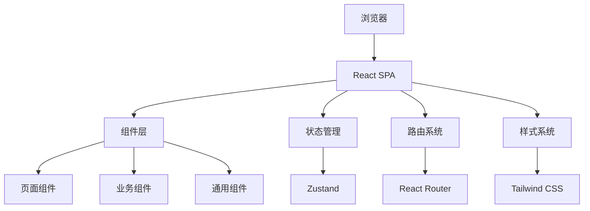
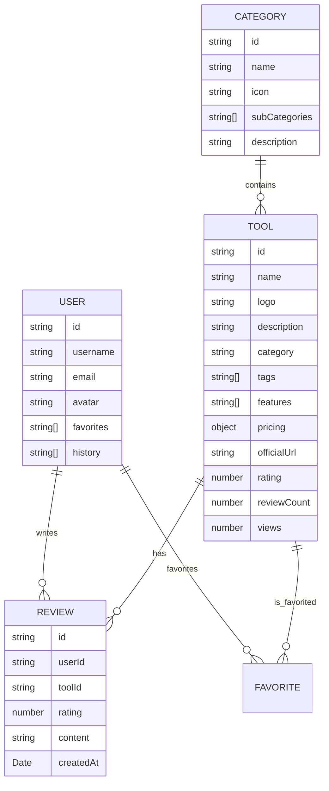

## 1. Architecture Design
采用现代React单页应用架构，使用客户端状态管理，无需后端服务，所有数据在前端模拟存储。



## 2. Technology Description
- **前端**: React@18 + TypeScript@5 + Tailwind CSS@3 + Vite@5
- **状态管理**: Zustand@4
- **路由**: React Router DOM@6
- **图标**: Lucide React@0.300
- **样式**: Tailwind CSS + CSS变量（主题切换）
- **构建工具**: Vite
- **初始化工具**: vite-init
- **后端**: 无（前端模拟数据）
- **数据库**: 本地Storage存储用户数据

## 3. Route Definitions
| Route | Purpose |
|-------|---------|
| / | 首页 |
| /category/:categoryId | 分类工具列表页 |
| /tool/:toolId | 工具详情页 |
| /user | 用户中心 |
| /user/favorites | 收藏管理 |
| /user/history | 浏览历史 |
| /topics | 专题合集 |
| /topics/ranking | 排行榜 |
| /topics/compare | 工具对比 |
| /login | 登录页 |
| /register | 注册页 |

## 4. API Definitions（前端模拟）
TypeScript类型定义：
```typescript
interface Tool {
  id: string;
  name: string;
  logo: string;
  description: string;
  category: string;
  subCategory?: string;
  tags: string[];
  features: string[];
  pricing: {
    type: 'free' | 'freemium' | 'paid';
    price?: string;
  };
  officialUrl: string;
  rating: number;
  reviewCount: number;
  views: number;
  createdAt: Date;
}

interface User {
  id: string;
  username: string;
  email: string;
  avatar?: string;
  favorites: string[];
  history: string[];
  reviews: Review[];
}

interface Review {
  id: string;
  userId: string;
  toolId: string;
  rating: number;
  content: string;
  createdAt: Date;
}

interface Category {
  id: string;
  name: string;
  icon: string;
  subCategories?: string[];
  description: string;
}
```

## 5. 前端文件结构
```
/workspace
├── src/
│   ├── components/
│   │   ├── layout/
│   │   │   ├── Navbar.tsx
│   │   │   ├── Footer.tsx
│   │   │   └── ThemeToggle.tsx
│   │   ├── tool/
│   │   │   ├── ToolCard.tsx
│   │   │   ├── ToolGrid.tsx
│   │   │   └── ToolDetail.tsx
│   │   ├── category/
│   │   │   ├── CategoryCard.tsx
│   │   │   └── CategoryNav.tsx
│   │   ├── search/
│   │   │   └── SearchBar.tsx
│   │   └── ui/
│   │       ├── Button.tsx
│   │       ├── Card.tsx
│   │       ├── Input.tsx
│   │       └── Rating.tsx
│   ├── pages/
│   │   ├── Home.tsx
│   │   ├── CategoryPage.tsx
│   │   ├── ToolDetailPage.tsx
│   │   ├── UserCenter.tsx
│   │   ├── TopicsPage.tsx
│   │   ├── Login.tsx
│   │   └── Register.tsx
│   ├── hooks/
│   │   ├── useTheme.ts
│   │   ├── useTools.ts
│   │   └── useUser.ts
│   ├── store/
│   │   ├── useToolStore.ts
│   │   └── useUserStore.ts
│   ├── utils/
│   │   ├── mockData.ts
│   │   ├── constants.ts
│   │   └── helpers.ts
│   ├── types/
│   │   └── index.ts
│   ├── App.tsx
│   ├── main.tsx
│   └── index.css
├── public/
├── package.json
├── tsconfig.json
├── vite.config.ts
├── tailwind.config.js
└── postcss.config.js
```

## 6. Data Model
### 6.1 Data Model（前端模拟）


### 6.2 模拟数据示例（存入 mockData.ts）
- 预置50+个AI工具数据
- 预置9个主分类数据
- 预置多个专题合集
