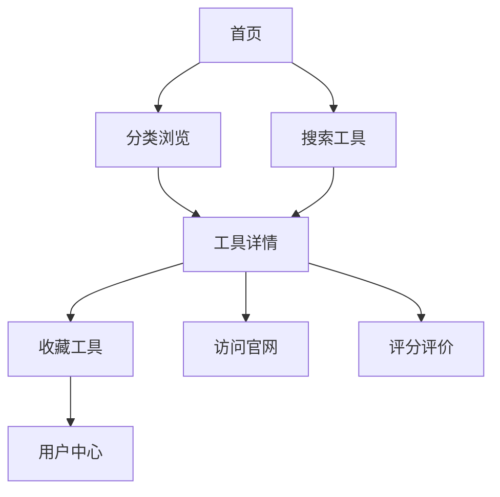

## 1. Product Overview
汽水AI导航是一个专业的AI工具教程导航网站，旨在帮助用户快速发现、了解和使用各种AI工具。

- 主要目标：打造一站式AI工具发现平台，覆盖写作、设计、视频、编程、办公、学习、语音等9大领域
- 市场价值：满足快速增长的AI工具市场需求，为用户提供结构化的工具发现和选择服务

## 2. Core Features

### 2.1 User Roles
| Role | Registration Method | Core Permissions |
|------|---------------------|------------------|
| 普通用户 | 未登录 | 浏览工具、搜索、查看详情 |
| 注册用户 | 邮箱/手机号注册 | 收藏工具、评分评价、浏览历史、个性化推荐 |

### 2.2 Feature Module
1. **首页**: 英雄区域、分类导航、搜索框、热门工具、专题推荐
2. **分类页面**: 工具列表、分类筛选、标签筛选、排序功能
3. **工具详情页**: 工具介绍、功能特性、价格信息、用户评价、相关推荐
4. **用户中心**: 个人信息、收藏管理、浏览历史、评分偏好
5. **专题页**: 专题合集、排行榜、工具对比、AI需求匹配
6. **登录/注册**: 用户认证、账号管理

### 2.3 Page Details
| Page Name | Module Name | Feature description |
|-----------|-------------|---------------------|
| 首页 | 英雄区域 | 品牌展示、快速搜索、热门分类入口 |
| 首页 | 分类导航 | 9大主分类、二级分类展开、分类图标展示 |
| 首页 | 热门工具卡片 | 工具Logo、名称、描述、评分、标签系统 |
| 分类页面 | 筛选区域 | 多维度筛选、搜索结果实时更新 |
| 工具详情页 | 信息展示 | 完整工具介绍、功能特性列表、价格方案、官方链接 |
| 用户中心 | 收藏管理 | 收藏/取消收藏、分类查看、筛选排序 |
| 专题页 | 工具对比 | 多工具对比表格、功能差异高亮 |

## 3. Core Process
用户进入网站 → 浏览/搜索工具 → 查看工具详情 → 收藏/评分 → 使用工具访问官方使用工具访问工具使用工具访问官方链接

## 4. User Interface Design
### 4.1 Design Style
- **主色调**: 深蓝色渐变 (#0f172a 到 #1e293b
- **辅助色**: 科技蓝 (#3b82f6)、活力蓝 (#06b6d4)
- **按钮风格**: 圆角按钮，悬停时有微动画
- **字体**: Orbitron（标题）、Inter（正文）
- **布局风格**: 卡片式布局、网格布局、柔性布局
- **图标风格**: 简洁现代的线性图标

### 4.2 Page Design Overview
| Page Name | Module Name | UI Elements |
|-----------|-------------|-------------|
| 首页 | 英雄区域 | 渐变背景、神经网络元素装饰、智能大脑Logo、渐变文字、搜索框带放大镜图标、动态卡片悬浮效果 |
| 分类导航 | 分类卡片 | 圆形图标背景、渐变文字、悬停上浮动画 |
| 工具卡片 | 统一模板、logo展示、渐变色标签、评分星级展示 |
| 工具详情页 | 信息卡片 | 标签栏、功能特性列表、渐变色标签、评分卡片 |
| 导航栏 | 固定顶部、深色/浅色模式切换按钮、用户头像、登录入口 |

### 4.3 Responsiveness
- Desktop-first design, mobile-adaptive
- 移动端适配手机屏幕断点：320px-768px
- 平板端：768px-1024px
- PC端：1024px以上
- 触摸优化：增大可点击区域最小44px

### 4.4 设计亮点
- 深色/浅色模式无缝切换
- 沉浸式视差滚动效果
- 卡片悬停微动画
- 加载状态骨架屏
- 响应式网格布局
- 流畅的页面过渡动画
