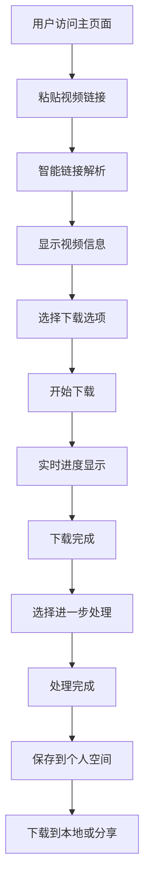

## 1. Product Overview
全功能音视频素材处理工具是一款专为内容创作者打造的一站式无水印视频下载 + 音视频处理平台，解决了内容创作者 "找素材难、去水印难、处理繁琐" 的核心痛点。
- 主要目标用户为内容创作者、视频剪辑师、自媒体从业者等需要大量音视频素材的人群
- 产品价值在于提供高效、高质量的素材获取和处理能力，节省创作者时间成本，提升创作效率

## 2. Core Features

### 2.1 User Roles
| Role | Registration Method | Core Permissions |
|------|---------------------|------------------|
| 免费用户 | 邮箱注册 | 基础下载功能，有限的处理次数 |
| Pro 版用户 | 付费订阅 | 无限制下载和处理，高级 AI 功能 |
| 企业版用户 | 企业认证 | 团队协作，批量处理，定制化服务 |

### 2.2 Feature Module
1. **主页面**：视频下载模块、导航栏、功能入口
2. **音频处理页面**：音频提取、音轨分离、格式转换
3. **AI 辅助创作页面**：字幕生成、视频摘要、智能剪辑
4. **视频处理页面**：去水印、格式转换、倍速调整、裁剪
5. **个人空间**：任务管理、文件管理、历史记录

### 2.3 Page Details
| Page Name | Module Name | Feature description |
|-----------|-------------|---------------------|
| 主页面 | 视频下载模块 | 支持单作品链接、批量链接、合集/播放列表下载，智能链接解析，最高画质优先，强制无水印，一键去声下载 |
| 主页面 | 独立采集窗口 | 弹出独立浏览器窗口获取 Cookie，解锁最高画质 |
| 主页面 | 个人空间后台下载 | 任务在服务器后台运行，关闭浏览器不影响 |
| 音频处理页面 | 音频提取 | 从视频中提取 320kbps 高音质音频 |
| 音频处理页面 | 多音轨分离 | AI 驱动，分离人声、鼓、贝斯、钢琴、其他乐器 5 个音轨 |
| 音频处理页面 | 格式转换 | 支持 MP3、AAC、WAV、FLAC 等常见音频格式批量转换 |
| AI 辅助创作页面 | 智能字幕生成 | 使用 Whisper v3 生成 SRT/ASS 格式字幕，支持 99 种语言 |
| AI 辅助创作页面 | 视频内容摘要 | 自动提取视频核心内容，生成 3-5 个关键要点 |
| AI 辅助创作页面 | AI 智能剪辑 | 自动识别视频高潮部分，生成 60 秒短视频 |
| 视频处理页面 | 视频去水印 | 支持固定位置水印去除和 AI 智能去水印 |
| 视频处理页面 | 视频格式转换 | 批量转换为 MP4、MOV、AVI 等剪辑软件兼容格式 |
| 个人空间 | 任务队列 | Celery+Redis 处理长时间任务，实时进度条 |
| 个人空间 | 文件管理 | 浏览、删除、重命名下载的文件，生成临时分享链接 |
| 个人空间 | 历史记录 | 永久保存所有下载和处理记录 |
| 个人空间 | 个人设置 | 自定义下载目录、命名规则、默认画质等 |
| 个人空间 | 付费订阅系统 | 支持 Stripe 支付，提供免费版/Pro 版/企业版 |

## 3. Core Process
用户使用流程：
1. 用户访问主页面，粘贴视频链接
2. 系统智能解析链接，显示视频信息
3. 用户选择下载选项（画质、是否去水印、是否去声）
4. 系统开始下载，显示实时进度
5. 下载完成后，用户可选择进一步处理（音频提取、去水印等）
6. 处理完成后，文件保存到个人空间，用户可下载到本地或分享

## 4. User Interface Design
### 4.1 Design Style
- 主色调：深蓝色 (#1E40AF) 和橙色 (#F97316) 作为主色，象征专业和活力
- 辅助色：浅灰 (#F3F4F6) 作为背景，深灰 (#374151) 作为文本
- 按钮风格：圆角矩形，有轻微的 3D 效果，悬停时有阴影变化
- 字体：使用 Inter 作为主要字体，清晰易读
- 布局风格：卡片式布局，模块化设计，层次分明
- 图标风格：使用 Lucide 图标库，线条简洁现代

### 4.2 Page Design Overview
| Page Name | Module Name | UI Elements |
|-----------|-------------|-------------|
| 主页面 | 视频下载模块 | 大型输入框，支持多行文本粘贴，旁边有 "解析" 按钮，下方有选项切换（单视频/批量/合集），进度条显示下载状态 |
| 主页面 | 独立采集窗口 | 弹出式浏览器窗口，顶部有红色提示文字，可最小化到左侧缓冲区 |
| 音频处理页面 | 音轨分离 | 上传区域，下拉选择分离模式，进度条，处理完成后显示音轨列表 |
| AI 辅助创作页面 | 智能字幕生成 | 上传区域，语言选择下拉框，进度条，生成后可编辑字幕 |
| 个人空间 | 任务管理 | 任务列表，状态指示器，进度条，操作按钮（暂停/取消/重试） |
| 个人空间 | 文件管理 | 文件卡片，支持拖拽排序，操作菜单（下载/分享/删除） |

### 4.3 Responsiveness
- 设计采用桌面优先原则，同时支持移动端自适应
- 在移动端设备上，布局会自动调整为垂直堆叠式
- 触摸优化：增大按钮点击区域，支持手势操作
- 响应式断点：1200px（桌面）、768px（平板）、480px（手机）

### 4.4 3D Scene Guidance
- 不适用 3D 场景，产品以功能为主，注重实用性和易用性