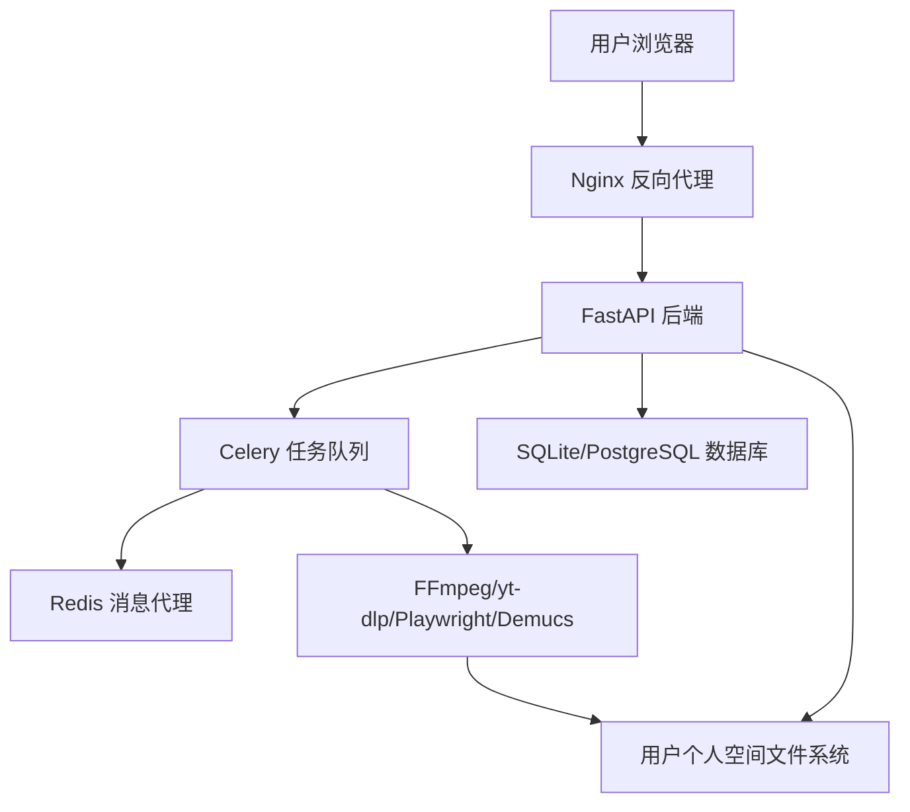
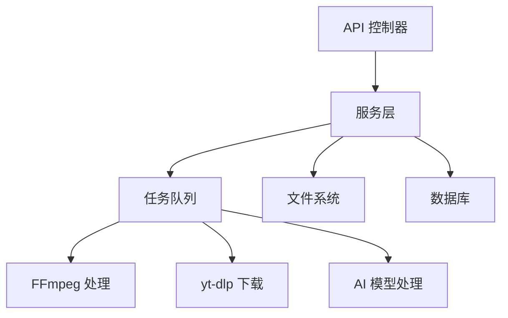
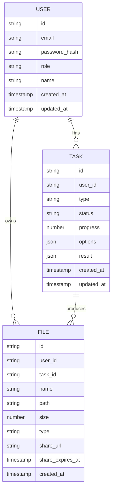

## 1. Architecture Design


## 2. Technology Description
- 前端：React@18 + TypeScript + Tailwind CSS@3 + Vite
- 后端：FastAPI@0.100+ + Python@3.10+
- 视频下载核心：yt-dlp@2024.04.09+
- 音视频处理：FFmpeg@6.0+
- AI 音轨分离：Meta Demucs v4
- 语音识别：OpenAI Whisper v3
- 嵌入式浏览器：Playwright@1.40+
- 任务队列：Celery@5.3+
- 消息代理：Redis@7.0+
- 数据库：SQLite/PostgreSQL
- 支付系统：Stripe

## 3. Route Definitions
| Route | Purpose |
|-------|---------|
| / | 主页面，视频下载功能 |
| /audio | 音频处理页面 |
| /ai | AI 辅助创作页面 |
| /video | 视频处理页面 |
| /space | 个人空间，任务和文件管理 |
| /settings | 个人设置页面 |
| /subscription | 订阅管理页面 |

## 4. API Definitions
### 4.1 视频下载 API
- **POST /api/download**
  - 请求体：`{"url": string, "options": {"quality": string, "no_watermark": boolean, "no_audio": boolean}}`
  - 响应：`{"task_id": string, "status": "queued"}`

- **GET /api/task/{task_id}**
  - 响应：`{"task_id": string, "status": string, "progress": number, "result": object}`

- **POST /api/batch-download**
  - 请求体：`{"urls": string[], "options": {"quality": string, "no_watermark": boolean, "no_audio": boolean}}`
  - 响应：`{"task_ids": string[], "status": "queued"}`

### 4.2 音频处理 API
- **POST /api/audio/extract**
  - 请求体：`{"video_id": string, "format": string}`
  - 响应：`{"task_id": string, "status": "queued"}`

- **POST /api/audio/separate**
  - 请求体：`{"audio_id": string, "mode": string}`
  - 响应：`{"task_id": string, "status": "queued"}`

- **POST /api/audio/convert**
  - 请求体：`{"audio_id": string, "format": string, "bitrate": number}`
  - 响应：`{"task_id": string, "status": "queued"}`

### 4.3 AI 辅助创作 API
- **POST /api/ai/subtitle**
  - 请求体：`{"video_id": string, "language": string, "format": string}`
  - 响应：`{"task_id": string, "status": "queued"}`

- **POST /api/ai/summary**
  - 请求体：`{"video_id": string}`
  - 响应：`{"task_id": string, "status": "queued"}`

- **POST /api/ai/clip**
  - 请求体：`{"video_id": string, "duration": number}`
  - 响应：`{"task_id": string, "status": "queued"}`

### 4.4 视频处理 API
- **POST /api/video/remove-watermark**
  - 请求体：`{"video_id": string, "method": string, "position": object}`
  - 响应：`{"task_id": string, "status": "queued"}`

- **POST /api/video/convert**
  - 请求体：`{"video_id": string, "format": string}`
  - 响应：`{"task_id": string, "status": "queued"}`

- **POST /api/video/speed**
  - 请求体：`{"video_id": string, "speed": number}`
  - 响应：`{"task_id": string, "status": "queued"}`

- **POST /api/video/crop**
  - 请求体：`{"video_id": string, "resolution": string, "aspect_ratio": string}`
  - 响应：`{"task_id": string, "status": "queued"}`

### 4.5 用户和文件 API
- **GET /api/files**
  - 响应：`{"files": [{"id": string, "name": string, "size": number, "type": string, "created_at": string}]}`

- **GET /api/files/{file_id}/download**
  - 响应：文件流

- **POST /api/files/{file_id}/share**
  - 响应：`{"share_url": string, "expires_at": string}`

- **DELETE /api/files/{file_id}**
  - 响应：`{"status": "success"}`

- **GET /api/tasks**
  - 响应：`{"tasks": [{"id": string, "status": string, "progress": number, "created_at": string, "updated_at": string}]}`

## 5. Server Architecture Diagram


## 6. Data Model
### 6.1 Data Model Definition


### 6.2 Data Definition Language
```sql
-- User table
CREATE TABLE IF NOT EXISTS users (
    id TEXT PRIMARY KEY,
    email TEXT UNIQUE NOT NULL,
    password_hash TEXT NOT NULL,
    role TEXT DEFAULT 'free',
    name TEXT,
    created_at TIMESTAMP DEFAULT CURRENT_TIMESTAMP,
    updated_at TIMESTAMP DEFAULT CURRENT_TIMESTAMP
);

-- Task table
CREATE TABLE IF NOT EXISTS tasks (
    id TEXT PRIMARY KEY,
    user_id TEXT NOT NULL,
    type TEXT NOT NULL,
    status TEXT DEFAULT 'queued',
    progress REAL DEFAULT 0,
    options JSONB,
    result JSONB,
    created_at TIMESTAMP DEFAULT CURRENT_TIMESTAMP,
    updated_at TIMESTAMP DEFAULT CURRENT_TIMESTAMP,
    FOREIGN KEY (user_id) REFERENCES users(id)
);

-- File table
CREATE TABLE IF NOT EXISTS files (
    id TEXT PRIMARY KEY,
    user_id TEXT NOT NULL,
    task_id TEXT,
    name TEXT NOT NULL,
    path TEXT NOT NULL,
    size INTEGER NOT NULL,
    type TEXT NOT NULL,
    share_url TEXT,
    share_expires_at TIMESTAMP,
    created_at TIMESTAMP DEFAULT CURRENT_TIMESTAMP,
    FOREIGN KEY (user_id) REFERENCES users(id),
    FOREIGN KEY (task_id) REFERENCES tasks(id)
);

-- Indexes
CREATE INDEX IF NOT EXISTS idx_tasks_user_id ON tasks(user_id);
CREATE INDEX IF NOT EXISTS idx_files_user_id ON files(user_id);
CREATE INDEX IF NOT EXISTS idx_files_task_id ON files(task_id);
```